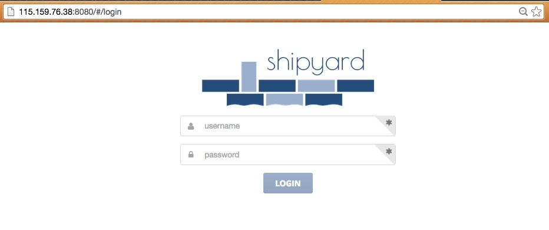
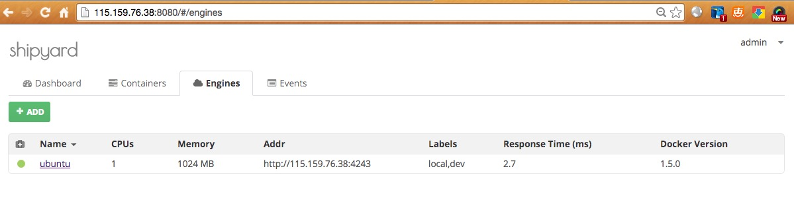
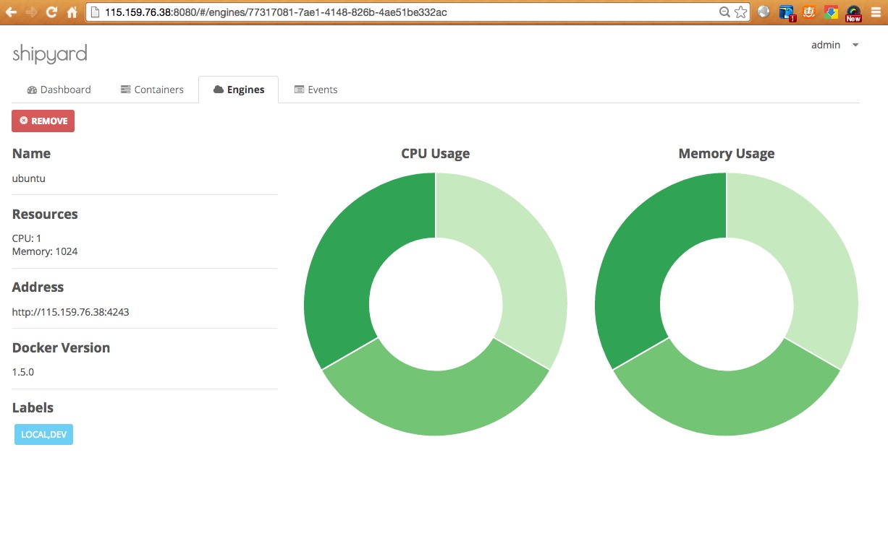
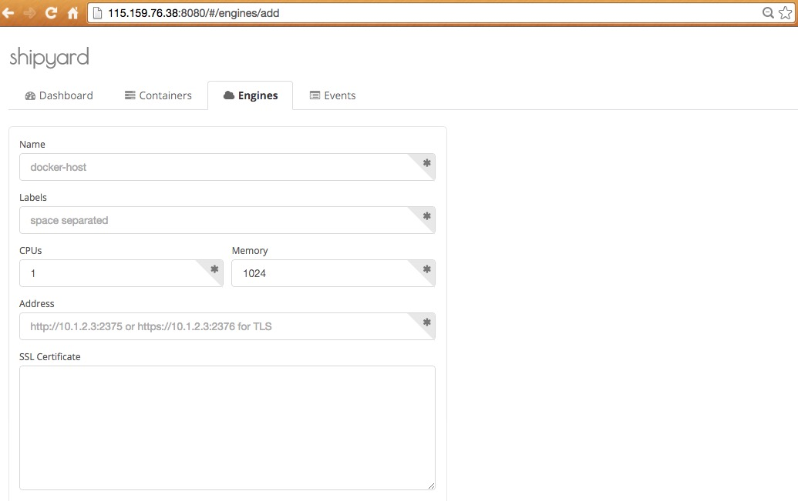

#Shipyard
##1 Shipyard介绍

Shipyard是一个Docker管理工具，建立在docker集群管理工具Citadel上的可以管理容器、主机等资源
的Web图形化工具。本文将介绍Shipyard的使用方式，使用它管理不同主机上Docker镜像和容器。

###1.1 Web UI

###1.2 CLI

###1.3 API

##2 Shipyard安装部署
Shipyard提供了两种安装部署方式，手动部署和自动部署，下面将分别进行介绍。


###2.1 手动部署（Manual Deployed）

Shipyard使用RethinkDB进行数据的存储，用户账号、服务密钥和引擎元数据等都将会存储在RethinkDB
创建的数据卷容器中，但是不会存储容器信息。

在启动Shipyard容器之前我们将先启动一个RethinkDB的数据卷容器Shipyard-rethinkdb-data，
专门用于数据存储:


	ubuntu@VM-13-96-ubuntu:~$ sudo docker run -it -d --name Shipyard-rethinkdb-data \ 	
	>   --entrypoint /bin/bash Shipyard/rethinkdb -l
	25a812ebe32a71b38828062f6273105108575b178326f843d80d6b677ef6eca9

从下面的RethinkDB的Dockerfile文件中的VOLUME指令可以看到，
数据卷容器会在其中创建一个数据卷挂载到容器的/data目录：

```
FROM ubuntu:14.04
MAINTAINER Shipyard Project "http://Shipyard-project.com"
ENV DEBIAN_FRONTEND noninteractive
RUN apt-get update && apt-get install -y wget && echo "deb http://download.rethinkdb.com/apt trusty main" > /etc/apt/sources.list.d/rethinkdb.list \
    && wget -qO- http://download.rethinkdb.com/apt/pubkey.gpg | sudo apt-key add -
RUN apt-get update
RUN apt-get install -y rethinkdb
EXPOSE 8080
EXPOSE 28015
EXPOSE 29015
WORKDIR /data
VOLUME /data
CMD ["--bind", "all"]
ENTRYPOINT ["/usr/bin/rethinkdb"]
```
然后，创建一个Shipyard-rethinkdb容器使用--volumes-from来挂载
Shipyard-rethinkdb-data容器中的数据卷，通过使用-P标记，Docker会随机映射主机的端口
至容器内部开放的网络端口。


	ubuntu@VM-13-96-ubuntu:~$ sudo docker run -it -P -d --name Shipyard-rethinkdb \
	>   --volumes-from Shipyard-rethinkdb-data Shipyard/rethinkdb
	9bb4959ef9a81014a404825326d06edb9b57834318cca21b0a41700c6877f39f

现在我们可以运行启动Shipyard容器了。
	

	ubuntu@VM-13-96-ubuntu:~$ sudo docker run -it -p 8080:8080 -d --name Shipyard \
	>   --link Shipyard-rethinkdb:rethinkdb Shipyard/Shipyard
	839d3d4467617ee0e0ab2c12dff56f96cf59105eff2d58c8b15b1eebec1648bd

至此，Shipyard的手动部署已经完成，我们可以查看我们刚才启动的几个容器。

```
ubuntu@VM-13-96-ubuntu:~$ sudo docker ps
CONTAINER ID        IMAGE                       COMMAND                CREATED             STATUS              PORTS                                                                         NAMES
839d3d446761        Shipyard/Shipyard:2.0.10    "/controller"          19 hours ago        Up 19 hours         0.0.0.0:8080->8080/tcp                                                        Shipyard                  
9bb4959ef9a8        Shipyard/rethinkdb:latest   "/usr/bin/rethinkdb    19 hours ago        Up 19 hours         0.0.0.0:49156->28015/tcp, 0.0.0.0:49157->29015/tcp, 0.0.0.0:49158->8080/tcp   Shipyard-rethinkdb        
25a812ebe32a        Shipyard/rethinkdb:latest   "/bin/bash -l"         19 hours ago        Up 19 hours         8080/tcp, 28015/tcp, 29015/tcp                                                Shipyard-rethinkdb-data   
```

通过查看启动容器的信息，我们能看到安装部署Shipyard之后会开启几个端口：

```
49156：rethinkDB 实例
49157：rethinkDB 集群
49158：rethinkDB Web界面
8080：Shipyard Web界面
```

接下来我们将可以通过访问主机的8080端口浏览Shipyard的主界面了：



Shipyard会先创建一个默认的用户名(admin)和密码(Shipyard)，
通过用户名和密码就能登陆到我们自己创建的Shipyard Web服务了。
当然登陆之后你会发现页面里面没有我们主机上启动的容器的相关信息，这可不是因为我们的部署过程出问题了，
Shipyard使用了Engine的概念，将会在下一节进行介绍。

###2.2 自动部署（Shipyard Deployed）

当然，Shipyard提供了一个自动的安装部署方式，我们就不用向前面那样自己手动部署好几个容器，
只需要一条命令即可完成Shipyard的安装部署。如果想深入了解具体的运行机制可以参考：
[shipyard-deploy](https://github.com/shipyard/shipyard-deploy)


```
clearraining@clearraining:~$ sudo docker run --rm -v /var/run/docker.sock:/var/run/docker.sock shipyard/deploy start
Pulling image: shipyard/rethinkdb
Starting Rethinkdb Data
Starting Rethinkdb
Starting Shipyard
Pulling image: shipyard/shipyard:latest
Shipyard Stack started successfully
 Username: admin Password: shipyard
```

是不是很简单，接下来我们进入下一小节来具体了解Shipyard到底是如何管理容器的。


##3 Shipyard中的几个重要概念
在这一节将介绍shipyard的具体使用。


###3.1 用户管理

目前shipyard还不支持在Web UI模式下进行用户管理，所以我们在CLI模式下进行操作，我们需要启动一个
docker-cli容器：

```
ubuntu@VM-13-96-ubuntu:~$ sudo docker run --rm -it shipyard/shipyard-cli
shipyard cli>
```
这样就进入了shipyard-cli命令行模式。

shipyard支持多用户管理，需要先登录才能管理shipyard集群。上一章节所讲的shipyard会自动生成一个有管理员权限的admin用户，为了能在启动shipyard之后能够进行登录管理操作，现在我们就用这个默认生成的管理员来登录：

```
shipyard cli> shipyard login
URL: http://115.159.76.38:8080
Username: admin
Password: 
shipyard cli> 
```
登陆成功后就可以进行用户的管理工作，下面添加用户：

```
shipyard cli> shipyard add-account -u clearraining -p psw -r user 
shipyard cli> shipyard accounts 
Username        Role
admin           admin
clearraining    user
shipyard cli> 
```
add-account命令通过-u参数指定用户名，-p指定密码和-r指定用户类型，用户类型分为“admin”和“user”。然后可以查看shipyard集群中的用户信息。


```
shipyard cli> shipyard accounts 
Username        Role
admin           admin
clearraining    user
raining         user
shipyard cli> 
```

除了添加用户之外我们还可以进行用户的删除和密码修改等操作，代码如下：

```
shipyard cli> shipyard delete-account raining
shipyard cli> shipyard accounts 
Username        Role
admin           admin
clearraining    user
shipyard cli> 
```

```
shipyard cli> shipyard change-password clearraining
Password: 
Confirm: 
shipyard cli>
```

shipyard提供的多用户的管理能方便不同类型的用户对shipyard集群中的容器进行相关操作。


###3.2 Engines

一个shipyard集群能管理一个或者更多的engines，同时一个engine就是一个绑定监听接口的Docker守护进程，
通俗一点就是一个engine相当于一台主机。并且shipyard只使用Docker API来进行管理。


#### 3.2.1 CLI 中的创建和查询

首先添加一个engine，在shipyard中通过add-engine命令添加engine，
在添加engine之前我们需要指定Docker守护进程绑定到网络接口：


```
sudo sh -c "echo 'DOCKER_OPTS=\"-H tcp://0.0.0.0:4243 -H unix:///var/run/docker.sock\"' >> /etc/default/docker"
```

现在我们可以进行engine的添加工作了。

```
shipyard cli> shipyard add-engine --id 'ubuntu' \
> --addr 'http://115.159.76.38:4243' \
> --cpus '1.0' --memory '1024' \
> --label 'local' --label 'dev'
```

通过--id标志指定添加的engine的名称，我们这里命名为“ubuntu”。我们使用--addr标志指定了
我们要添加的engine的网络地址，我们还可以多engine要使用的cpu和内存进行设置，--cpus和--memory
将帮助我们完成这一要求。为了方便对engine进行管理，可以使用--label对engine进行标识，
可以指定任意个标识使管理员更容易的管理engine，也为容器部署在多engine上提供了方便。


当我们成功添加一个engine之后，我们可以查看我们添加的engine信息：


```
shipyard cli> shipyard engines 
ID                                      Name    Cpus    Memory  Host                            Labels          Health  Response Time (ms)      Docker Version
a47a7f16-4e47-4c85-8fc4-18fdf251e33e    ubuntu  1.00    1024.00 http://115.159.76.38:4243       local,dev       up      1.3                     1.5.0
```

如果你想查看某一个engine的详细信息，还可以通过inspect-engine查看指定的engine信息。

```
shipyard cli> shipyard inspect-engine a47a7f16-4e47-4c85-8fc4-18fdf251e33e
{
    "id": "a47a7f16-4e47-4c85-8fc4-18fdf251e33e",
    "engine": {
        "id": "ubuntu",
        "addr": "http://115.159.76.38:4243",
        "cpus": 1,
        "memory": 1024,
        "labels": [
            "local",
            "dev"
        ]
    },
    "health": {
        "status": "up",
        "response_time": 1334016
    },
    "docker_version": "1.5.0"
}
```

```
注意：这里必须填写完整的engine ID。
	
```

这样通过shipyard的命令行模式就成功的添加了一个engine。

#### 3.2.2 Web UI 中的浏览和创建

shipyard除了可以在命令行模式中进行engine的管理外也可以通过Web UI的方式进行管理操作。

首先通过浏览器访问我们部署的shipyard，我们可以看到engine下我们添加的engine：



接着我们就可以点击查看某个engine的相关信息：




除了查看engine的信息之外我们还可以通过UI的方式进行engine的添加，通过点击ADD按钮，
填入所需的参数就能完成在UI上的添加：



这样关于engine的查询和添加就叙述到这，更多的相关操作读者可以自行研究。


#### 3.2.3 engine 的删除

在shipyard中engine的删除很简单，在命令行中输入remove-engine命令即可完成删除操作。

```
shipyard cli> shipyard remove-engine a47a7f16-4e47-4c85-8fc4-18fdf251e33e
removed ubuntu
```

在Web UI中的删除只需点击REMOVE按钮就完成删除。

####3.2.4 番外篇

通过这一小节对engine的介绍，相信大家对engine有了一个了解，但是shipyard可不仅仅是简单的
创建和删除等内容这么简单，shipyard能够统一管理很多个engine并且能在这么多的engine上进行
相关的管理操作。

### 3.3 Containers

#### 3.3.1 参数介绍

#### 3.3.2 Web UI中的查询和创建过程

#### 3.3.3 CLI 中的查询和创建举例


```
shipyard cli> shipyard run --name ehazlett/go-demo \
> --cpus 0.1 \
> --memory 32 \
> --type service \
> --hostname demo-test \
> --domain local \
> --env FOO=bar \
> --label dev \
> --pull
started ed7e3d60bbfe on clearraining
```


```
shipyard cli> shipyard scale --id ed7e --count 2
scaled ed7e3d60bbfe to 2
```


#### 3.3.4 Scale a Container （扩展容器数量）

#### container的删除

### 3.4 Events and Cluster info（记录和信息查询）

##4 Development environment
